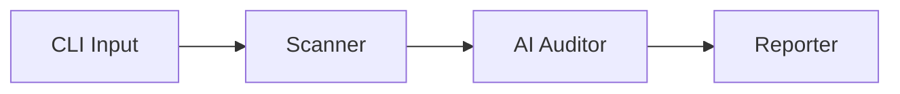

# How VibeAudit Works (Technical Architecture)

VibeAudit is a **Defensive Static Analysis Tool** that acts as an "AI Red Teamer" for your local smart contracts. Instead of just matching patterns (like Slither), it uses a Large Language Model (LLM) to "reason" about business logic and generate exploit Proof-of-Concepts (PoCs).

## 1. The Pipeline

The tool follows a linear 3-stage process:



### A. Scanner (`src/scanner.ts`)
- Recursively finds all `.sol` files in the target directory.
- Reads their content into memory.
- **Why?** To feed the raw source code to the AI.

### B. AI Auditor (`src/auditor.ts`)
This is the core "brain". It sends the prompt to **OpenRouter** (Gemini 2.0 Flash / OpenAI).
- **System Prompt**: Functions as a "Red Team" security expert.
- **Instructions**:
  1.  Analyze code for **KNOWN** bugs (Reentrancy, Overflow).
  2.  Analyze code for **NOVEL** logic errors (Business Logic, Invariants).
  3.  **Generate PoC**: Write a specific Foundry test case demonstrating the exploit.
- **Output**: Strict JSON array of findings.

### C. Reporter (`src/reporter.ts`)
- Parses the JSON findings.
- Generates a Markdown report in `audit_reports/`.
- Includes the **Exploit PoC** code block so you can copy-paste it into a test file.

## 2. Novel Detection Mechanism
Traditional tools use **Abstract Syntax Trees (AST)** and **Regex**:
- *Slither*: "If `call.value` exists before state update -> Reentrancy."

**VibeAudit (AI)** uses **Semantic Understanding**:
- *AI*: "This function calculates fees based on `balanceOf(pool)`, but a Flash Loan can manipulate `balanceOf(pool)` atomically. Therefore, this fee logic is exploitable."

This allows it to find **Logic Errors** that synthesize multiple valid lines of code into an invalid state.

## 3. Exploit Verification (PoC)
To prove a vulnerability exists without attacking a live chain, VibeAudit generates a **Foundry Test**:

```solidity
// AI Generated PoC Example
function testExploit() public {
    // 1. Borrow 1000 ETH via Flash Loan
    // 2. Call vulnerable function
    // 3. Assert attacker balance > initial
}
```

You run this test locally (`forge test`). If it passes (i.e., the exploit works), you have confirmed the bug safely.
