# How VibeAudit Works (Offensive Architecture)

VibeAudit is an **Automated Smart Contract Attack Tool** with three modes of operation.

## Architecture

```
vibeAudit/src/
├── main.ts              # CLI: attack, exploit, mev commands
├── scanner.ts           # Local .sol file reader
├── onchain.ts           # Fetch contract from blockchain (bytecode + Etherscan source)
├── auditor.ts           # AI brain — offensive prompts, generates Foundry exploit code
├── exploit-runner.ts    # Creates Foundry project, runs forge test --fork-url, parses results
├── mev-scanner.ts       # Scans recent blocks for exploit opportunities
├── reporter.ts          # Generates attack and MEV reports
└── utils.ts             # Shared helpers (Foundry check, env config)
```

## Pipeline

```mermaid
graph TD
    A[Target] --> B{Mode?}
    B -->|address| C[On-Chain Fetcher]
    B -->|.sol file| D[File Scanner]
    B -->|mev| E[Block Scanner]
    C --> F[AI Attacker]
    D --> F
    E --> G[AI MEV Analyzer]
    F --> H[Exploit Runner<br>forge test --fork-url]
    G --> I[MEV Report]
    H --> J{PASS or FAIL?}
    J -->|PASS| K[💀 CONFIRMED EXPLOIT]
    J -->|FAIL| L[❌ False Positive]
    K --> M[Attack Report]
    L --> M
```



## Key Components

### AI Attacker (`auditor.ts`)
- Two specialized prompts: **Exploit** (generates full Foundry tests) and **MEV** (finds profitable opportunities)
- Demands **complete, runnable Solidity test contracts** — not snippets
- Focuses on Theft, Locking, and Manipulation

### Exploit Runner (`exploit-runner.ts`)
- Creates a temporary Foundry project (`.vibeaudit-exploits/`)
- Installs `forge-std` automatically
- Copies target source code into the workspace
- Runs `forge test --fork-url <RPC> -vvv`
- Parses output: **PASS** = exploit confirmed, **FAIL** = false positive

### MEV Scanner (`mev-scanner.ts`)
- Scans recent blocks for newly deployed contracts
- Fetches source from Etherscan (if verified) or analyzes bytecode patterns
- Filters by minimum balance threshold
- Ranks opportunities by estimated profit
