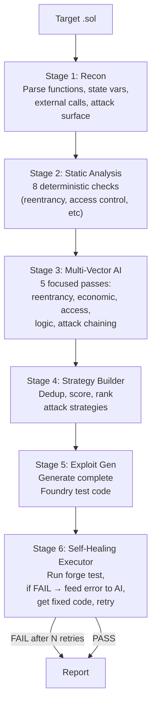

# VibeAudit — 6-Stage Attack Pipeline

## What Was Built

VibeAudit now runs a **6-stage automated attack algorithm** instead of a single AI pass.

## The Pipeline



## Pipeline Files

| File | Purpose |
|------|---------|
| `src/pipeline/recon.ts` | Contract parsing — functions, state vars, external calls, attack surface |
| `src/pipeline/static-analysis.ts` | 8 deterministic checks (reentrancy, access control, tx.origin, etc) |
| `src/pipeline/ai-analysis.ts` | 5 focused AI passes (reentrancy, economic, access, logic, chains) |
| `src/pipeline/strategy.ts` | Dedup + score + rank strategies |
| `src/pipeline/exploit-gen.ts` | Generate complete Foundry test files |
| `src/pipeline/executor.ts` | Self-healing: run → fail → AI fix → retry (up to 3x) |
| `src/pipeline/index.ts` | Pipeline orchestrator + report generation |

## Usage

```bash
# Full pipeline (default)
npm run exploit -- ./test-contracts/VulnerableVault.sol

# With more retries for self-healing
npm run exploit -- ./contracts/ --retries 5

# Old single-pass mode
npm run exploit -- ./contracts/ --simple
```

## Verification
- ✅ TypeScript compiles with zero errors
- Pipeline wired into both `attack` and `exploit` commands
